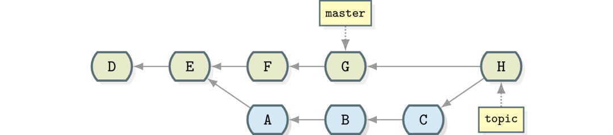

@title[Introduction]
## How to Git Good
### Or how to use git rebase.

---
@title[Introduction]
* Rebase as a branching strategy.
* Rebase as a tool to rewrite history.
---
@title[Rebase]
## What is `git-rebase`? 

+++
Rebasing is the process of moving or combining a sequence of commits to a new base commit

+++

{size=auto 90%}
{size=auto 90%}

+++
## Pros
* One neat line git history
* Easy to revert a single commit.

## Cons
* Force push
* Cascading merge conflicts
---
@title[Merge]

## Merge

+++

{size=auto 90%}
{size=auto 90%}

+++

## Pros
* Easy to understand
* Easier to solve merge conflict.

## Cons
* Pollutes history with merge commits
* Harder to traverse git history
---
@title[begin Workshop]

### https://github.com/jayway/git-workshop

### https://tinyurl.com/ycty7obf
